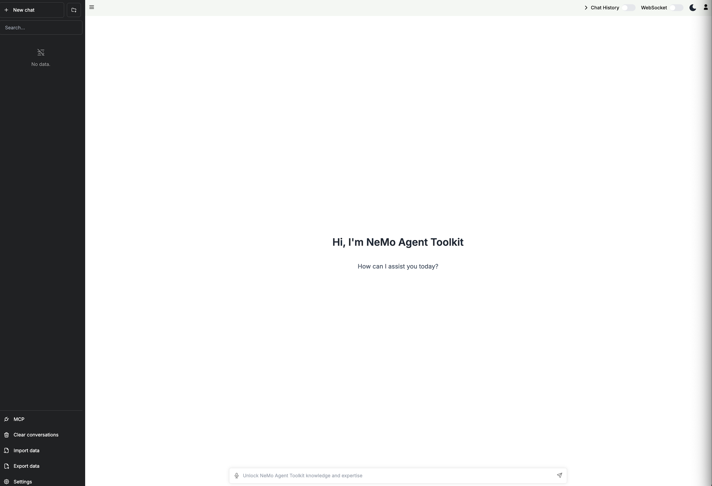

# AIQ Toolkit - UI

[](LICENSE)
[](https://github.com/NVIDIA/AIQToolkit/tree/main)

This is the official frontend user interface component for [AIQ Toolkit](https://github.com/NVIDIA/AIQToolkit/tree/main), an open-source library for building AI agents and workflows.

This project builds upon the work of:
- [chatbot-ui](https://github.com/mckaywrigley/chatbot-ui) by Mckay Wrigley
- [chatbot-ollama](https://github.com/ivanfioravanti/chatbot-ollama) by Ivan Fioravanti

## Features
- 🎨 Modern and responsive user interface
- 🔄 Real-time streaming responses
- 🤝 Human-in-the-loop workflow support
- 🌙 Light/Dark theme
- 🔌 WebSocket and HTTP API integration
- 🐳 Docker support

## Getting Started

### Prerequisites
- [AIQ Toolkit](https://github.com/NVIDIA/AIQToolkit/tree/main) installed and configured
- Git
- Node.js (v18 or higher)
- npm or Docker

### Installation

Clone the repository:
```bash
git clone git@github.com:NVIDIA/AIQToolkit.git
cd AIQToolkit
```

### Running the Application

#### Local Development

Install dependencies:

```bash
npm ci
```

```bash
npm run dev
```
The application will be available at `http://localhost:3000`



#### Docker Deployment
Please see [Usage Examples](#usage-examples) for Docker deployment examples with complete server setups.

## Configuration

### HTTP API Connection
Settings can be configured by selecting the `Settings` icon located on the bottom left corner of the home page.


### Settings Options
NOTE: Most of the time, you will want to select /chat/stream for intermediate results streaming.

- `Theme`: Light or Dark Theme
- `HTTP URL for Chat Completion`: REST API endpoint
  - /generate - Single response generation
  - /generate/stream - Streaming response generation
  - /chat - Single response chat completion
  - /chat/stream - Streaming chat completion
- `WebSocket URL for Completion`: WebSocket URL to connect to running AIQ Toolkit server
- `WebSocket Schema`: Workflow schema type over WebSocket connection

## Usage Examples

### Simple Calculator Example

#### Option 1: Docker Compose (Recommended)
For a complete setup with the UI, calculator server, and Phoenix Telemetry:

```bash
# Make sure you're logged into NVIDIA's container registry
# The NeMo-Agent-Toolkit calculator server requires this to build image. 
docker login nvcr.io
# Username: $oauthtoken
# Password: <your-nvidia-api-key>

# Make sure you have your NVIDIA API key set
export NVIDIA_API_KEY=your_api_key_here

docker compose -f compose_calculator.yaml up -d
```

That's it! This will start:
- **UI** on `http://localhost:3000`
- **Calculator Server** on `http://localhost:8000` (with API docs at `/docs`)
- **Phoenix Telemetry** on `http://localhost:6006`


To check containers and logs:

```bash
docker ps -a
docker logs aiq-ui
```

To stop the services:
```bash
docker compose -f compose_calculator.yaml down
```

#### Option 2: Manual Setup (Requires External Server)

1. Set up [AIQ Toolkit Get Started ](https://github.com/NVIDIA/AIQToolkit/blob/main/docs/source/intro/get-started.md)
2. Start the calculator server by following the [Simple Calculator Example](https://github.com/NVIDIA/AIQToolkit/blob/main/examples/simple_calculator/README.md)
```bash
aiq serve --config_file=examples/basic/functions/simple_calculator/configs/config.yml
```
3. Start the UI using one of these approaches:

**Local UI:**
```bash
npm run dev
```

**Docker UI:**
```bash
# Build the Docker image
docker build -t aiqtoolkit-ui .

# Requires --network=host to access external server
docker run -d --name aiq-ui --network=host --env-file .env aiqtoolkit-ui
```

**Important Notes for Manual Docker Setup:**
- ⚠️ **Security Warning**: Docker with `--network=host` gives the container access to all host network interfaces. Only use this for local development, never in production or shared environments.
- Both UI options can access the calculator server on `localhost:8000` directly

#### Testing the Calculator
Interact with the chat interface by prompting the agent with the message:
```
Is 4 + 4 greater than the current hour of the day?
```


## API Integration

### Server Communication
The UI supports both HTTP requests (OpenAI compatible) and WebSocket connections for server communication. For detailed information about WebSocket messaging integration, please refer to the [WebSocket Documentation](https://github.com/NVIDIA/AIQToolkit/blob/main/docs/source/references/websockets.md) in the AIQ Toolkit documentation.


## License
This project is licensed under the MIT License - see the [LICENSE](LICENSE) file for details. The project includes code from [chatbot-ui](https://github.com/mckaywrigley/chatbot-ui) and [chatbot-ollama](https://github.com/ivanfioravanti/chatbot-ollama), which are also MIT licensed.

